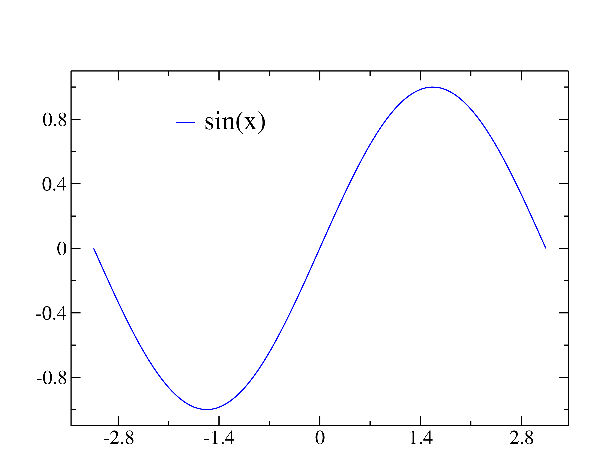
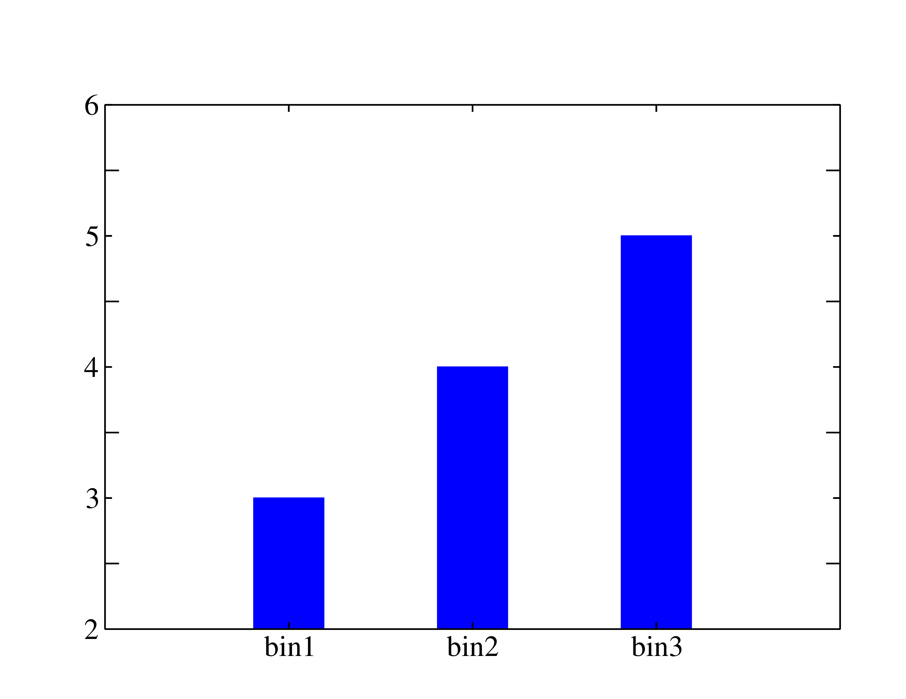
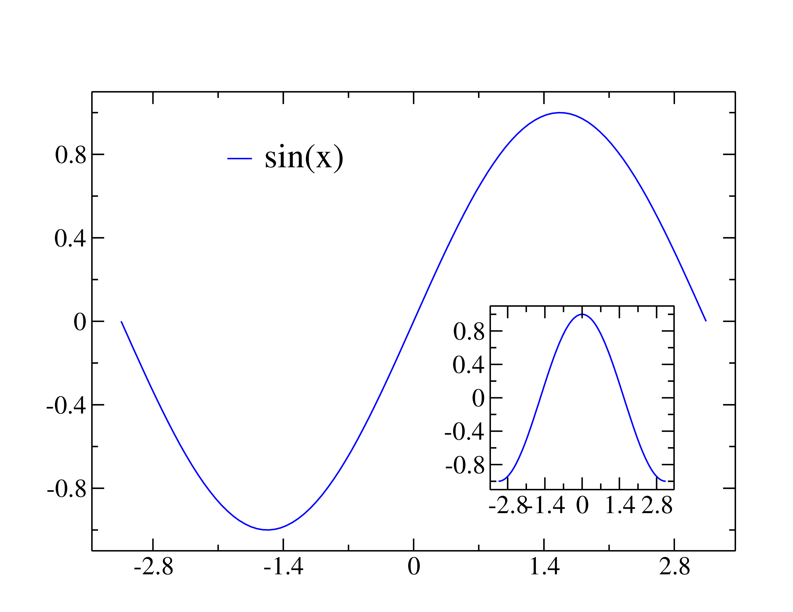
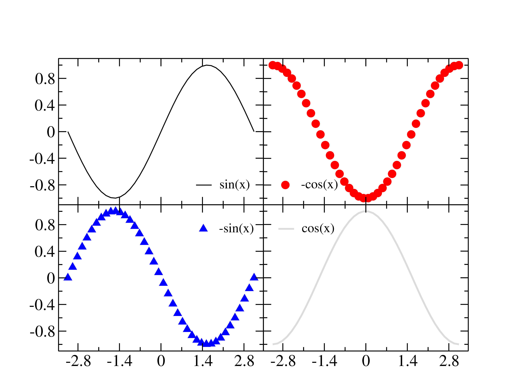

# pygraceplot

A matplotlib.pyplot emulation for creating Grace plots.

## Why another python implementation of Grace?

1. A practice of personal Python programming
2. More user-friendly by emulating the popular `matplotlib` package
3. Written in Python 3.

## Requirement

- Python >= 3.7, but 3.5 should be sufficient
- NumPy

Run `pip install -r requirements.txt` to install dependencies.
If you use `conda`, try

```bash
conda install -c conda-forge -n myenv --file requirements.txt
```

Note that in this case you may need to set your virtual environment `myenv` first.

## Installation

Assume that `pygraceplot` is cloned to `path/to/pygraceplot`.

```bash
export PYTHONPATH="path/to/pygraceplot:$PYTHONPATH"
```

## Usage

`pygraceplot` is capable of generating grace file for simple plots,
such as one-variable mathematical functions ([sin](examples/sin.py)),
bar graphs ([bar](examples/bar.py)), but also some complicated ones
such as bar plots, array of graphs and insets.

For a quick example,

```python
import numpy as np
from pygraceplot import Plot
p = Plot(1, 1)
x = np.linspace(-1, 1, 20)
y = x ** 2
p.plot(x, y)
p.tight_graph()
p.write("squarex.agr")
p.savefig("squarex.png")
```

draws an function `y=x^2`, export to grace file `squarex.agr`
and use `gracebat` to generate PNG file.

## Examples

1. `Sin` function

   

2. A bar plot

   

3. Graph with inset 

   

4. Array of graphs

   

For more usage, pleae see scripts and figures in `examples`.

## Documentation

### Plot appearance and export control object: `Plot`

#### Initialization

`Plot` accepts both positional and keyword arguments

- Positional arguments
  - `nrows`: number of rows
  - `ncols`: number of columns
- Optional keyword arguments for graph alignments
  - `description`: a `str` for describing the project.
  - `hgap`, `vgap`: the interval between graphs in a row and in a column, respectively.
    A float number can be parsed. One can also parse a list of float, whose length
    should be the same as the number of intervals.
  - `width_ratios`, `heigh_ratios`: determine the ratios of graphs in their widths and heights.
    A `str` should be parsed, with the ratio of each graph in a column/row separated by colon `:`.
- Optional keyword arguments for styling
  - `bc`: background color, an `int` or `str` as the color identifier.
  - `background`: switch for the fill of background. Set to `'none'` for transparent background.
  - `lw`, `ls`, `color`, `pattern`, `charsize`, `symbolsize`: these are arguments parsed to the
    `Default` object to determine the default behavior (linewidth, linestyle, color, fill pattern) 
    of objects when created in the xmgrace GUI.

Another way to initialize is to use the factory method `Plot.subplots`
It has the same keyword arguments and basically does the same
thing as `Plot`, but it has a more convenient way to specify number of rows and columns:

- with no positional argument: plot with a single graph
- Single positional argument, convertable to `int`:
  - `n` < 10 draws a plot with one column and `n` rows
  - `10*m+n` in (10, 100), draws a plot with `m` rows and `n` columns

#### Methods

Methods manipulates the `Graph` object itself

- `get`: get the `Graph` object of the plot. Default return a list of all graphs. Accepts `int` as argument.
- `set_default(**kwargs)`: set the `Default` object
- `add_graph`: add a new graph. It accepts four arguments for the viewpoint of the new graph.
   Returns the added graph.
- `write`: write to agr file.
- `savefig`: generate a figure file by using the Grace engine `gracebat`

The following methods essentially call the corresponding method of all `Graph` objects in the plot:

- `plot`
- `xticks`/`yticks`
- `xlabel`/`ylabel`: call `set_xlabel` and `set_ylabel` of `Graph`
- `set_xaxis`, `set_yaxis`
- `set_xlim`, `set_ylim`
- `tight_graph`

Please see the next section for these method.

### Workhorse of data plotting: `Graph`

#### Plotting data

The most import method is `plot`, which plots the data on the graph.

- `set`
- `set_title`/`set_subtitle`
- `set_legend`
- `set_legend_box`
- `set_view`

#### axis related 

- `x`/`y` properties: get the `Axis` object for x/y axis.
- `set_xticks`
- `set_xlabel`
- `set_xticklabel`
- `set_xlim`
- `set_limit`
- `set_axis`

#### objects drawing

- `text`
- `circle`
- `axhline`
- `axvline`
- `axline`
- `arrow`


### Customization with `~/.pygraceplotrc`

Some extent of customization can be done by writing `.pygraceplotrc` file at home directory.

#### Colormap

More colors than the defaul can be defined by a tuple named `color_map`.
Each member of it should also be a member containing 3 `int` for standard RGB values and a `str` for the name of color.
For example

```python
color_map = (
    (204, 12, 32, "Red"),
    (30, 30, 101, "Blue"),
    (18, 147, 210, "ProcessBlue"),
    (66, 176, 193, "SkyBlue"),
    (18, 139, 57, "Green"),
    (120, 120, 120, "Gray"),
    (254, 208, 10, "Gold"),
    )
```

These colors will be loaded by the `ColorMap` object and exported to every grace file.

## Miscs

### Handling of `.eps` file exported by grace

The encapsulated postscript exported by the grace engine
is not optimzed. It would be better to first process it by the
[`eps2eps`](https://nixdoc.net/man-pages/linux/man1/eps2eps.1.html) program.
Then one can convert the `.eps` to `.png` by using
[imagemagick](https://www.imagemagick.org/). For example,

```bash
convert -density 300 sin.eps sin.png
```

The figures in the [examples](examples/) is produced in this way.

